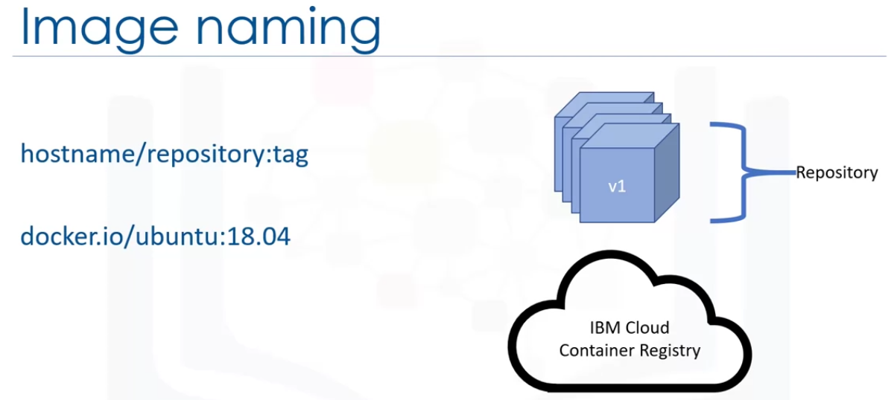

# Introduccion a Contenedores, Kubernetes y OpenShift

## Semana 1
## ¿Que es un contenedor?
Es una unidad ejecutable de software en la que el código de la aplicación se empaqueta junto con sus bibliotecas y dependencias, de manera común para que pueda ejecutarse en cualquier lugar, ya sea en un escritorio local o en la nube. 
Para ello, los contenedores aprovechan una forma de virtualización del sistema operativo en la que se aprovechan las características del sistema operativo para aislar procesos y controlar la cantidad de CPU, memoria y almacenamiento en disco a la que tiene acceso esos procesos.
En el caso del nuclo de Linux, los spacios de nombres **(namespaces)** y **cgroups** son las primitivas del SO que permiten la virtualización. 

Los contenedores son pequeños, rápidos y portátiles porque, a diferencia de una maquina virtual, **no necesitan incluir un sistema operativo invitado en todas las instancias** y pueden simplemente **aprovechar las características** y recursos del sistema operativo host.
Los contenedores aparecieron por primera vez hace mucho tiempo, pero la era moderna de los contenedores comenzó en 2013 con la introducción de Docker.

En resumen un contenedor es:
* Unidad de software ejecutable
    - Encapsulan todo lo necesario para correr
    - Pueden correr en cualquier lugar
* Virtualización del Sistema Operativo (OS)
    - Procesos aislados
    - Control de recursos que alojan a los procesos
* Pequeños, Rápidos y portábles.
    - No necesitan incluir un SO invitado en cada instancia.

*Los contenedores son una estandarización de como empaquetamos y enviamos software, todas las dependencias necesarias para ejecutar una aplicación se empaquetan con ella, lo que facilita moverla y ejecutarla en una variedad de ambientes.*

Los contenedores pueden ejecutar cualquier cosa siempre y cuando pueda empaquetarse como un contenedor. Esta portabilidad es muy util para los desarrolladores, la ventaja frente a las maquinas virtuales es el nivel de abstracción que proporcionan ya que los hacen ligeros y portatiles. Los contenedores son livianos y comparten el núcle del sistema operativo de la maquina, eliminando la necesidad de instancia completa para una aplicación. Su tamaño más pequeño comparado con las maquinas virtuales permiten que gire rápidamente y son más capaces de admitir aplicaciones nativas de la nube las cuales escalan de forma horizontal.

Los contenedores llevan todas sus dependencias consigo mismos por lo que sólo deben configurarse una vez y despues no es necesario configurar en laptops, en la nube o en entornos locales eliminando la preocupación por instalar diferentes dependencias para cada entorno. Gracias a su tamaño ligero y alta escalabilidad permite que los cambios en ellas sean incrementales.

Al igual que las maquinas virtuales, los contenedores le permiten a los desarrolladores y operadores mejorar la utilización del CPU y la memoria. Los contenedores van aún más allá porque también **habilitan una arquitectura de microservicios**, lo que significa que los componentes de la aplicación se pueden implementar y escalar de forma más detallada, esta granularidad proporciona una alternativa atractiva a tener que escalar una aplicacion monolitica completa, por ejemplo cuando solo se carga un componente.


**Beneficios de los contenedores:**

* Ligeros:
    - No incluyen un SO invitado.
    - Giro rápido y escalado horizontal.
* Portable y plataforma independiente
* Ideales para patrones modernos de desarrollo, desarrollo y de arquitectura.
* Mejora en la utilización de recursos.

## Contenedores VS Maquinas Virtuales

**Maquinas virtuales:**
Con las maquinas virtuales, un hipervisor se ejecuta en la parte superior de la infraestructura; este hipervisor es el responsable de crear maquinas virtuales, trata recursos como la CPU y la memoria como un grupo que puede ser utilizado por las diversas maquinas virtuales que se ejecutan en el hardware. En este modelo, el hardware se virtualiza para que varias maquinas con sistemas operativos  potencialmente diferentes para que puedan ejecutarse en el mismo hardware físico. Como se muestra en el diagrama, cada maquina virtual tiene sus propias configuraciones.

|Hipervisor|
|--|
|Maquinas virtuales|


**Contenedores**

Encima tenermos el motor de contenedores que igual que el hipervisor es responsable de ejecutar los contenedores. De esta manera, los contenedores virtualizan el sistema operativo en lugar de infraestructura, esto permite que la infraestructura utilice una misma base, permitiendo que los binarios, bibliotecas y aplicaciones se ejecuten en el motor contenedor.

La aplicación no necesita un SO debido a que lo comparten, esto permite que las aplicaciones inicien de una manera muy rápida con muy pocos recurso traduciendose a MegaBytes y en segundos o minutos.


Hoy en día muchas organizaciones están considerando el uso de contenedores como un reemplazo de maquinas virtuales para tareas de proposito general de aplicaciones y cargas de trabajo.

Los contenedores son una excelente alternativa para arquitecturas basadas en microservicios donde las aplicaciones se construyen con muchos servicios poco acoplados y la combinacion de microservicios y contenedores es una base común para muchos equipos que adoptan DevOps como la forma en que crean, envian y ejecutan el software dado que los contenedores pueden ejecutarse de forma coherente en cualquier lugar, en entornos de portatiles, locales y en la nube dado que son una arquitectura subyacente ideal para escenarios de nube hibrida y multinube debido a que en la mayoria de los casos las organizaciones usan nubes publicas y sus propios centros de datos para la operación. Otra caracteristica muy importante de poner aplicaciones en contenedores es poder migrar a la nube.

En resumen:
* Microservicios:
    - Independientes y deployables servicios.
* DevOps
* Hibrido, multinube.
    - Ejecución consistente atraves de ambientes.


# DOCKER:
Docker es una plataforma de software para crear y ejecutar aplicaciones como contenedores. Docker proporcionó una forma sencilla de construir y ejecutar contenedores a través de una plataforma open source.


Docker, la empresa, se basa en las tecnologías de código abierto existentes, contribuye de nuevo a la comunidad para crear nuevas tecnologías. Una de las herramientas más utilizadas de Docker es la interfaz de linea de comandos **CLI** 

## Comandos de Docker

### Docker build
Los desarrolladores proporcionan un **Dockerfile**, un archivo que sirve como **blueprint** para construir una imagen contenedor.
El comando **`docker build`** toma ese archivo y realiza el trabajo pesado para contruir una imagen, el comando tambien *permite a los usuarios etiquetar sus imágenes*, lo que básicamente significa darles un nombre.

### Dockertag
Puede etiquetar imagenes directamente mediante el comando `docker tag`, permite renombrar, o copiar y renombrar una imagen a modo de darle un nuevo nombre.
El comando `tag` no sobreescribirá la imagen existente que tiene en la máquina, creará una nueva etiqueta para la imagen.

### images
El comando `images` enumerará todas las imagenes, sus repositorios y etiquetas y sus tamaños. Una vez que construya o etiqueta una imagen, debe haber una entrada actualizada en la salida de `imagenes acoplables`, esto proporcionará una forma sencilla de verificar que sus comandos `build` y `tag` se ejecutaron correctamente.

### Docker run
Se utiliza para ejecutar un contenedor. Sí está desarrollando imagenes de contenedor y desea probar una imagen que ha desarrollado  puede ejecutarla como contenedor localmente.

### Push
Permite ubicar una imagen en una ubicación remota

### Pull
Permite recuperar una imagen de una ubicación remota.

|Commando|Función|
|--|--|
|`docker build`|Se utiliza para crear imagenes de contenedor, requiere de un docker file|
|`docker tag`|Permite etiquetar imagenes|
|`images`|Listará todas las imagenes, los repositios, etiquetas y sus tamaños|
|`docker run`|Se utiliza para ejecutar un contenedor|
|`push`|Permite almacenar una imagen en una ubicación remota|
|`pull`|Permite recuperar imagenes de una ubicacion remota|

## Runtime

Docker es un motor de ejecución. Un motor de ejecución de contenedor es un software que ejecuta contenedores al igual que el comando **`docker run`**.

## Container Runtime
Los contenedores comparten el sistema operativo.


Docker es probablemente el tiempo de ejecución de contenedores más popular y conocido, pero Docker también ha introducido **el tiempo de ejecución** `containerd` que está ganando popularidad rapidamente.

* Otros: 
Otros tiempos de ejecución como **rkt** también se utilizan en el mercado.


# Building Container Images

## Development of a container
Este diagrama muestra el proceso de desarrollo de un contenedor.


### Dockerfile y blueprint
Un Dockerfile es el **plano** a partir del cual se construye una imagen. A docker file serves as the **blueprint** for an image.
El Dockerfile describe todos los pasos que se deben tomar para construir la imagen deseada; Docker luego construye la imagen.

Una imagen y un contenedor son diferentes aunque también se puede llamar imagen de contenedor. **imagen diferente de contenedor**. 


### imagen
Una imagen es un archivo inmutable que contiene el código fuente, las bibliotecas y las dependencia necesarias para que la aplicación corra. Esa inmutabilidad significa que las imagenes son de sólo lectura; si cambia una imagen, creará una nueva imagen. En cierto sentido, las **imagenes son plantillas o blueprints para un contenedor**. También puede pensar que las imagenes son como instantaneas para un contenedor. Por lo tanto, **un contenedor es una imagen en ejecución** 


Dado que las imagenes son de sólo lectura, se coloca una capa de escritura sobre las imagenes para permitir que el contenedor se ejecute.


### Relación con POO

Para relacionar esto con la **programación orientada a objetos**, *una imagen de contenedor es como una clase, y un contenedor es un objeto instanciado de esa clase*.


Como se muestra en este diagrama, comienza con un **Dockerfile** que indica que incluir en la imagen.


Estos son los 3 pasos fundamentales.

## Image Layers

Docker puede crear automáticamente imágenes de contenedor mediante las instrucciones de un Dockerfile. `Un Dockerfile es implemente un archivo de texto que contiene todos los comandos que un usuario llamaría en la linea de comandos para crear una imagen`

Docker proporciona un conjunto de instrucciones para todo este proceso.

Las imagenes se construyen capa por capa, con *cada instrucción Docker creando una nueva capa encima de capas existentes*, a medida que se ejecutan las instrucciones de Docker, se crean nuevas capas de sólo lectura para la imagen. *Dependiendo del tamaño de las imagenes ,puede haber algunas capas o muchas* En este caso solo tenemos 4 capas


Cuando creamos una instancia de esta imagen, obtenemos un contenedor en ejecución. En este caso se agrega una capa por encima de todas las demás.


Recordemos que los contenedores no son inmutables como las imagenes.
Las capas se pueden compartir entre imagenes, si dos imagenes tienen una capa en común, ambas imagenes dpueden usar esa capa sin tener que volver a crearla, esto puede ahorrar mucho espacio en el disco y ancho de banda de red al enviar y recibir imagenes.


## Dockerfile instructions

### FROM
Cualquier Dockerfile valido debe comenzar primero con una instrucción **FROM**, que inicializa una nueva etapa de compilación y especifica la imagen base sobre la que construirá las instrucciones posteriores. Esta imagen base suele ser de un repositorio público, como un sistema operativo o una imagen base para un idioma especifico como GO o Node JS.
Esta imagen base es el inicio para las otras imagenes.


### RUN
Instrucción **RUN**, ejecuta comandos, por ejemplo podemos poner un comando **bash** en una instrucción para correr una tarea especifica. Cada instrucción es una nueva capa añadida por encima de las capas anteriores.

### ENV
El comando **ENV** permite establecer variables de entorno en la imagen.

### ADD & COPY
Los comandos ADD y COPY son similares y permiten copiar archivos en la imagen. Lo podria usar para poner su código de aplicación o ejecutable en su imagen, la principal diferencia es que COPY  solo puede copiar archivos locales y ADD también puede agregar archivos desde direcciones URL remotas.

### CMD
Solo puede haber una instrucción CMD en un Dockerfile, si se incluye más de 1 sólo surtirá efecto el último. El propósito principal de esta instrucción es proporcionar un valor predeterminado para ejecutar un contenedor.
Esta instrucción a menudo define el ejecutable que debe ejecutarse en su contenedor.

* DOCKER INTRUCTIONS:
    - FROM:
        Define base image
    - RUN:
        Execute arbitrary commands
    - ENV
        Set environment variables
    - ADD and COPY
        Copy files and directories
    - CMD
        Define default command for container execution


Ejemplo de un DockerFile:


# Container Registries

## ¿Que es un contenedor de registros?

Las imagenes del contenedor se pueden almacenar en su máquina local. Si ejecutal el comando **`docker build`** y crea una imagen de contenedor, ahora se almacena en su computadora. Sin embargo, necesitamos un lugar donde las imágenes del contenedor se puedan almacenar y recuperar fácilmente, se utiliza un registro de contenedor para el almacenamiento y la distribución de imágenes de contenedor con nombre. Aunque muchas características se pueden construir en la parte superior de un registro, **su función más básica es almacenar imágenes y permitir que alguien (o cualquier persona) las recupere posteriormente**

Los registros pueden ser públicos o privados, cuando una imagen se envía a un registro público, cualquiera puede extraer esa imagen esto es muy útil para proyectos de código abierto o desarrollo personal donde no importa si otros usan o inspeccionan tu imágenes.

La mayoría de las empresas optarán por utilizar un registro privado, que restringe el acceso a las imagenes para que sólo los usuarios autorizados puedan verlas y usarlas.

Los registros también pueden ser alojados o autoalojados, hay varios registros alojados disponibles, como *IBM Cloud Container Registry* en este caso, el usuario no necesita implementar o mantener el registro de ninguna manera; eso lo hace el proveedor. El usuario puede utilizar el registro como desee, sin embargo, también hay ofertas de registro que se pueden ejecutar en centros de datos privados o en una nube.

En resumen:
* Almacenamiento y distribución del nombre de contenedor de imagenes.
* Los registros pueden ser públicos o privados.
* Alojados o autoalojados

Hasta ahora hemos referido al almacenamiento y a la recuperación de imagenes, sin embargo, hay una terminología formal para ello.


Al almacenar una imagen en un registro, decimos que "Empuja" **push** una imagen al registro 


Del mismo modo, cuando se recupera una imagen de un registro decimos que se "extrae" **pull** una imagen de un registro


Las imagenes a menudo son empujadas por los desarrolladores, o a través de la automatización y una canalización de la compilación (pipeline) que han configurado.
Esas imágenes se pueden extraer a una máquina local, aunque a menudo son extraídas por sistemas que se ejecutan en la nube o en las instalaciones, como **Kubernetes**

## Image naming
Mencionamos que los registros almacenan imágenes con nombre, y sabemos que los comandos `docker build` y `docker tag` se pueden usar para nombrar imágenes. Pero hay un formato específico que generalmente se sigue para la nomenclatura de la imagen.El nombre de la imagen generalmente consta de tres partes: **hostname/repository:tag**  
Nombre del host/ repositorio / y la etiqueta

|hostname/repository:tag| 

* **Hostname**: El nombre del host identifica el registro al que se debe enviar esta imagen. 
    Para DockerHub, el registro es **docker.io**
    Para IBM CLoud Container Registry, el registro es **us.icr.io**, si está mandando al registro de Estados unidos.
* **Respository:**Un repositorio es un grupo de imágenes de contenedor relacionadas, por lo general, estas serán versiones diferentes de la misma aplicación o servicio, por lo que el nombre de la aplicación o servicio hace un buen nombre de repositorio
* **Tag:**La etiqueta proporciona información sobre una versión o variante específica de una imagen. La etiqueta suele ser un número de versión, o podría indicar alguna otra característica de la imagen, como el sistema operativo en el que se construyó


Veamos el siguiente ejemplo:

`docker.io/ubuntu:18.04`
Este nombre de imagen es sencillo, el nombre del host es `docker.io` indicando que estamos haciendo un pull de una imagen desde `Docker Hub`. El nombre del respositorio es `Ubuntu`, por lo que sabemos que estamos obteniendo una imagen de Ubuntu, finalmente la etiqueta es `18.04`, indicando la versión de Ubuntu.

De hecho, Docker CLI deduce el nombre de host docker.io si se escluye, por lo que podríamos ejecutar este comando más simple para extraer la imagen.



Dado que hay muchos registros de contenedores diferentes disponibles, las características adicionales que proporcionan ayudan a distinguirlos, considere IBM Cloud Registry de la siguiente imagen:


Una función denominada **Vulnerability Advisor** analiza las imágenes en busca de vulnerabilidades y exposiciones comunes al garantizar la seguridad antes de que se puedan explotar una vulnerabilidad, las empresas están protegidas de pérdidas financieras y prensa negativa.

En el lado derecho se encuentra IBM Cloud Kubernetes Service, que proporciona autenticación a IBM Cloud Container Registry de forma inemadiata, lo que facilita la implementación de imágenes desde el registro como contenedores en el servicio Kubernetes.


# Running Containers

El siguiente Dockerfile proporciona los pasos para crear una imagen que ejecutará una aplicación *Node.js*:


```
FROM node:9.4.0-alpine
COPY app.js .
COPY package.json .
RUN npm install &&\ 
    apk update &&\
    apk upgrade
CMD node app.js
```

Asumiendo que hemos escrito esta aplicación y los archivos existen, podemos utilizar el Dockerfile para crear una imagen.

**Descripción del DockerFile**
Se utiliza una imagen base de *node*, los artefactos se copian a nuestra imagen, las dependencias del *node* se instalan junto con algunas actualizaciones, y el comando *node app.js* se utiliza para ejecutar la aplicación en un contenedor.

El comando **`docker build`** utiliza Dockerfile para crear una imagen

`docker build -t my-app:v1.`

* **t:**Indica la opción *tag*, esto especifica el nombre que queremos dar a nuestra imagen. Recordemos que, el nombre consiste en: el nombre del host, que se puede omitir si estamos haciendo push a DockerHub, el repositorio y la etiqueta. En este caso hacemos el **push** hacia Dcoker Hub, por lo que no tenemos un nombre de host.

* **my-app:**Es el nombre del repositorio

* **v1:**será la etiqueta de nuestra versión.

* **.:**Hace referencial directorio actual.

**Build Context**
Por último, verá el punto al final de este comando, esto significa: Un punto es abreviado para el directorio actual. 

El último argumento para este comando es lo que se conoce como el contexto de compilación, este es el conjunto de archivos ubicados en esta ruta o URL que se usarán para generar la imagen


El Dockerfile normalmente se encuentra aquí. En nuestro ejemplo, usamos el directorio de trabajo actual como el contexto de compilación, por lo que pasamos el punto como un argumento. 
Sin embargo, tengamos en cuenta que también podemos escribir una ruta completa al contexto de compilación (en vez del punto). A continuación veremos un ejemplo de la salida del comando:

```
$ dockerfile build -t my-app:v1 .
Sending build context to Docker daemon 15.36kB
```

Primero el contexto de compilación se envia al demonio Docker, luego, las instrucciones de Docker se ejecutan en orden:

```
$ dockerfile build -t my-app:v1 .
Sending build context to Docker daemon 15.36kB
Step 1/5: FROM node:9.4.0-alpine
-->b5f94997f35f
Step 2/5: COPY app.js .
-->Using cache
-->3327e0636765
Step 3/5: COPY package.json .
--> Using cache
--> f513959ca800
Step 4/5: RUN npm install && apk update && apk upgrade
--> Using cache
--> b6...
Step 5/5: CMD node app.js
--> Running in a8f1c...
Successfully built b8b1...
Successfully tagged my-app:v1
```

Podemos ver que cada paso de esta salida corresponde a una de las instrucciones de nuestro Dockerfile, al final la imagen se construye con éxito, y se etiqueta como lo estipulamos. Para verificar, podemos usar el comando **docker image**.

**Salida del comando docker images**

```
$ docker images
REPOSITORY  TAG     IMAGE ID   CREATED      SIZE
my-app      v1      b8b15c59   2minutes ago 78.2MB
```

Se puede ver el nombre de la etiqueta, el id que se le asigno, cuando se creó y el tamaño.

¿Qué pasa si queremos usar esta imagen en otro contexto?
Podemos etiquetarlo y usarlo de nuevo para ello usaremos el comando `docker tag`, este comando creará una nueva etiqueta para esta imagen:

`docker tag my-app:v1 second-app:v1`

El comando `docker tag` primero tomará la imagen que desea etiquetar(en este caso **my-app:v1**) y toma la nueva etiqueta que desea aplicar (en este caso **second-app:v1**). 

```
$ docker images
REPOSITORY  TAG     IMAGE ID   CREATED      SIZE
my-app      v1      b8b15c59   4minutes ago 78.2MB
second-app  v1      b8b15c59   1minute ago  78.2MB
```

Notemos que el **ID** de imagen es el mismo en ambos casos, esto se debe a que la imagen en sí no ha cambiado, es decir, no hay nada diferente en estas dos imágenes y realizarán la misma función, la unica diferencia es que están etiquetadas de 2 maneras diferentes.

Es hora de ejecutar la imagen como un contenedor!

## Ejecutando como contenedor
Para ello simplemente necesitamos usar el comando **`docker run`** junto con nuestra etiqueta de imagen:

`docker run my-app:v1`

En este caso es una aplicación `Hello World` por lo que mprime un mensaje simple antes de salir.

## Haciendo PUSH
Finalmente haremos **PUSH** de la imagen hacia un registro para que podamos distribuirla y almacenarla para usarla más adelante, recordemos que el nombre del repositorio indica el nombre del registro al que se enviará la imagen, por lo que todo lo que se tiene que hacer es lanzar el comando `docker push`

```
$ docker push my-app:v1
The push refers to repository[docker.io/my-app]
17c1c3d548a9: Pushed
fb6fdfaa5784: Pushed
.
.
.
v1: digest: sha256:5533...... size:1576
```

Tras esa salida, si vieramos Docker Hub podriamos ver nuestra imagen.

